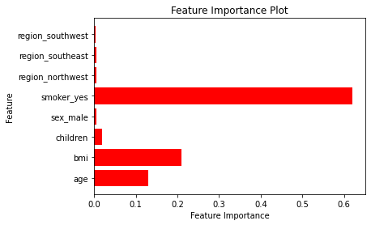
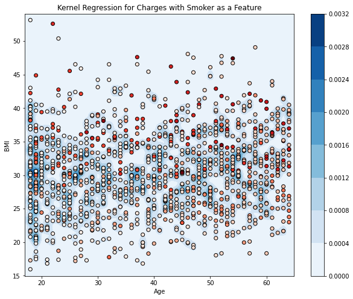
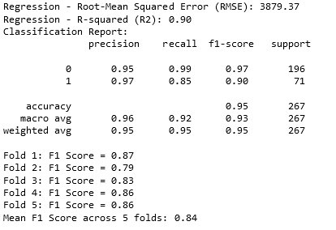

# Health Insurance Cost Prediction

This GitHub repository contains the code and resources for a machine learning project focused on predicting health insurance costs.

## Overview

Health insurance cost prediction is a critical task in the healthcare industry, and it can help individuals, insurance providers, and policymakers make informed decisions. This project leverages machine learning techniques to accurately predict health insurance costs based on various features, such as age, BMI, smoking habits, and more.

## Project Goal

The primary goal of this project is to develop a robust machine learning model capable of providing accurate predictions for health insurance costs. By analyzing factors contributing to insurance expenses, this project aims to empower individuals and insurance companies with valuable insights, facilitating better cost estimation and financial planning.

## Key Features

- **Data Preprocessing**: Comprehensive data cleaning and preparation for analysis.
- **Exploratory Data Analysis (EDA)**: In-depth exploration of data to extract meaningful insights about variable relationships.
- **Feature Importance**: Identifying the three most influential features: "Smoking Habits," "Age," and "BMI."

- **Normality Assessment**: Utilizing the Shapiro-Wilk test and QQ plot to demonstrate data non-normality.
- **Kernel Density Estimation**: Implementation of Kernel Density Estimation with a Gaussian kernel to visualize density clusters for insurance charges, considering "Smoking Habits" and "BMI" as primary features.

- **Regression Modeling**: Building and evaluating regression models tailored for insurance cost prediction.
- **Random Forest Regressor**: Achieving a baseline RMSE of approximately 4675 and an R-squared of 0.86.
- **Anomaly Removal**: Conducting minor anomaly removal procedures to enhance model robustness.
- **Hyperparameter Tuning**: Fine-tuning model parameters for improved predictive performance.
- **Cross-Validation**: Implementing 5-fold cross-validation to assess model generalization, resulting in an RMSE of 4340 and an R-squared of approximately 0.86.
  

- **Dataset**: The project employs a publicly available dataset from [Kaggle](https://www.kaggle.com/datasets/teertha/ushealthinsurancedataset) for analysis and model training.
